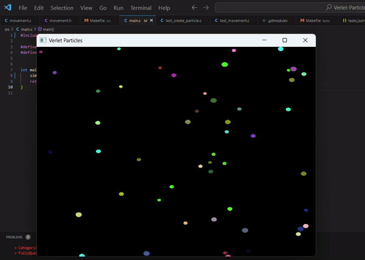

# Verlet Particles

This project implements Verlet integration to simulate particle physics in C, with GLFW for real-time visualization. You can directly run the `verlet_simulator.exe` inside `/bin`. It demonstrates a simple yet efficient way to model particle movement, particularly in cases where forces like gravity, springs, and collisions act on particles over time. The purpose of this project is to be very simple and readable.




## Table of Contents

- [Overview](#overview)
- [Features](#features)
- [Requirements](#requirements)
- [Installation](#installation)
- [Usage](#usage)
- [Project Structure](#project-structure)
- [References](#references)

## Overview

Verlet integration is a numerical method used to simulate the motion of particles with great stability and minimal computational cost, even with complex forces. This project leverages the Verlet algorithm to simulate realistic particle physics, including collision detection and response, within a 2D space. GLFW is used to render particles in real-time, allowing for visual feedback and manipulation of parameters like gravity, wind, or particle interaction forces.

## Features

- **Stable Verlet Integration**: Accurately simulates particle movement with position-based integration.
- **GLFW Visualization**: Real-time rendering of particles in a 2D environment.
- **Collision Handling**: Basic collision detection with boundaries or other particles.
- **Configurable Forces**: Adjustable parameters for gravity, drag, and custom forces.
- **Performance Efficient**: Optimized for a large number of particles, suitable for both educational and practical applications.

## Requirements

To build and run the project, ensure you have the following:

- **C compiler** (e.g., GCC)
- **GLFW** library installed
- **GLAD** for OpenGL function loading

For Ubuntu:

```bash
sudo apt-get update
sudo apt-get install libglfw3-dev libglfw3
